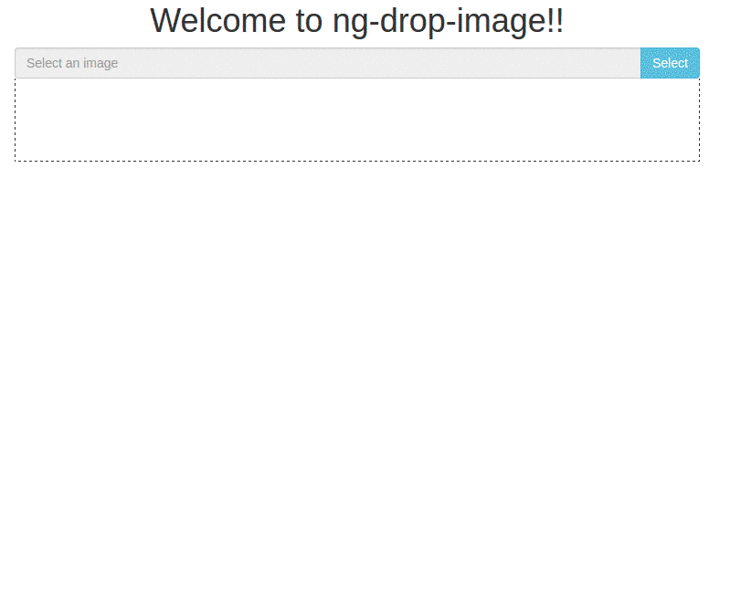

# @pluritech/ng-drop-image

An angular component to help you to handle with an single or multiple image. The images can be inputed by user using the traditional select or the drop functionality.

#### Demo (This repository has also the demo)
<p align="center">
  
</p>

#### Installation

```bash
$ npm install @pluritech/ng-drop-image --save
```

#### Using the ng-drop-image

```typescript
import { BrowserModule } from '@angular/platform-browser';
import { NgModule } from '@angular/core';

import { AppComponent } from './app.component';

// Import the library
import { DropImageModule } from '@pluritech/ng-drop-image';

@NgModule({
  declarations: [
    AppComponent
  ],
  imports: [
    BrowserModule,

    // Specify the library as an import
    DropImageModule
  ],
  providers: [],
  bootstrap: [AppComponent]
})
export class AppModule { }
```


Once the library is imported, you can use drop-image component in your Angular application:

```xml
<div class="container">
  <div class="row">
    <pluri-drop-image btnSelect="Select"
      [localList]="myUpdatedImageList"
      [serverList]="myServerImageList"
      [singleImage]="false"
      [hasError]="true"
      errorText="The image is too small"
      defaultText="Please, select or drop an image"
      inputPlaceholder="Select an image"
      (onImageChange)="whenChange($event)"
      minHeigth=1000
      minHeigth=1000
      (onError)="whenError($event)"
      (onUpdateList)="whenUpdateLocalList($event)"
      (onLocalImageSetAsMain)="whenLocalImageSetAsMain($event)"
      (onLocalImageDelete)="whenLocalImageDelete($event)"
      (onServerImageSetAsMain)="whenServerImageSetAsMain($event)"
      (onServerImageDelete)="whenServerImageDelete($event)">
    </pluri-drop-image>
  </div>
</div>
```

And, in the typescript side we have the following

```typescript
export class AppComponent implements OnInit {
  title = 'ng-drop-image';

  public myUpdatedImageList: Base64Image[] = [];
  public myServerImageList: any[] = [];
  ngOnInit() {
    fetch('https://randomuser.me/api/?results=4')
    .then(data => data.json())
    .then(data => data.results)
    .then(data => this.myServerImageList = data.map(person => {
      return {main: false, path: person.picture.large}
    }));
  }

  whenChange(image: Base64Image): void {
    console.log('image changed', image);
  }

  whenError(error: ErrorPicture): void {
    console.log('error picture', error);
  }

  whenUpdateLocalList(list: Base64Image[]): void {
    console.log('list updated', list);
  }

  whenLocalImageSetAsMain(image: Base64Image): void {
    console.log('image to set as main', image);
    image.main = true;
  }

  whenLocalImageDelete(image: Base64Image): void {
    console.log('image to delete', image);
    const index = this.myUpdatedImageList.indexOf(image);
    this.myUpdatedImageList.splice(index, 1);
  }

  whenServerImageSetAsMain(image: any): void {
    console.log('image to set as main in server', image);
    image.main = true;
  }

  whenServerImageDelete(image: any): void {
    console.log('image to delete in server', image);
    const index = this.myServerImageList.indexOf(image);
    this.myServerImageList.splice(index, 1);
  }
```

## Parameters
| Parameter        | Description           |
| ------------- |:-------------:|
| btnSelect     | The text of 'select image' button |
| hasError     |  An boolean expression to show the error text |
| errorText | The error text       |
| defaultText | The default text, something like... 'Please, drop an image      |
| inputPlaceholder | The text to be show in the blocked input       |
| singleImage | An boolean to indicate if you want to work with a single image or multiple. Default is true       |
| imagePath | The path of an image to show in the template, it can be a base64 or a image url, only if you're using an single image       |
| minWidth | Min width in pixels of any image inserted, default is null, so, every image will be accepted.       |
| minHeigth | Min heigth of any image inserted, default is null, so, every image will be accepted       |
| onError | An function to call when has an error with the image       |
| onImageChange | An function to call when the image have changed, only if you're using an single image       |
| localList | The local list of images need to be of type Base64Image       |
| onLocalImageSetAsMain | An function to call when an local image is seted as main       |
| onLocalImageDelete | An function to call when an local image is deleted       |
| onUpdateList | An function to call every time the list is updated, it emits the entire list       |
| serverList | The server list of images, type any, but, it need to have the propertie path and the propertie main       |
| onServerImageSetAsMain | An function to call when an server image is seted as main       |
| onServerImageDelete | An function to call when an server image is deleted       |


## To do
* Dont know yet

Feel free to make your pull request.

## Authors

* Mateus Durâes: https://github.com/mateusduraes

## License

MIT © 
